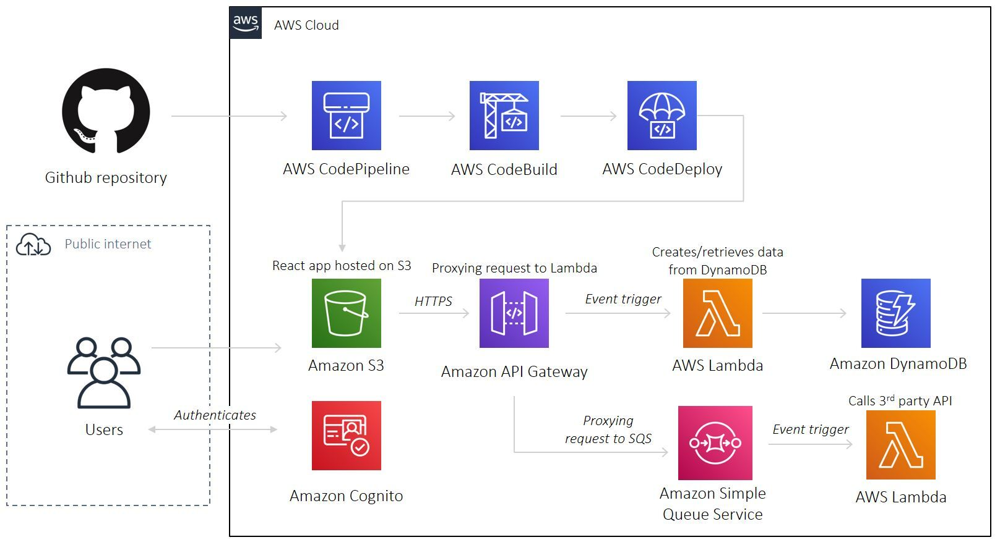

# CloudNine - Serverless Todo Application

A production-ready serverless full-stack application demonstrating modern cloud architecture patterns with React, AWS services, and Infrastructure as Code using Terraform.

## Overview

CloudNine is a todo list application that showcases the implementation of a serverless architecture on AWS. The application allows users to create, read, and manage their todos with data persisted in DynamoDB.

## Architecture



The application leverages multiple AWS services:

- **S3** - Static website hosting
- **CloudFront** - Content delivery network with SSL/TLS
- **API Gateway** - RESTful API endpoints
- **Lambda** - Serverless compute functions
- **DynamoDB** - NoSQL database for todo storage
- **Route 53** - DNS management
- **ACM** - SSL certificate management

## Tech Stack

- **Frontend**: React 18 with functional components and hooks
- **Backend**: AWS Lambda (Node.js runtime)
- **Database**: Amazon DynamoDB
- **Infrastructure**: Terraform (IaC)
- **CDN**: Amazon CloudFront
- **DNS**: Amazon Route 53
- **SSL/TLS**: AWS Certificate Manager

## Features

- Create and manage todo items
- Persistent storage with DynamoDB
- Serverless backend with automatic scaling
- Custom domain with SSL certificate
- Global content delivery via CloudFront

## Prerequisites

- AWS CLI configured with appropriate credentials
- Terraform >= 1.0
- Node.js 18+ for local development

## Configuration

Create a `terraform.tfvars` file with your settings:

```hcl
default_region      = "us-east-1"
github_username     = "your-github-username"
github_project_name = "your-project-name"
app_name            = "CloudNine"
environment         = "production"
```

## Deployment

### Deploy Infrastructure

```bash
cd deploy
terraform init
terraform apply
```

The output will provide the application URL after deployment.

### Local Development

```bash
# Install dependencies
npm install

# Configure API endpoint
# Update src/conf/config.js with your AWS resources

# Start development server
yarn start
```

Visit http://localhost:3000 to view the application.

### Custom Domain Setup

1. Purchase a domain via Route 53
2. Create email forwarding for domain validation
3. Request SSL certificate from AWS Certificate Manager
4. Add DNS A records for CloudFront distributions
5. Invalidate CloudFront cache on updates

## Project Structure

```
├── src/                    # React frontend
│   ├── components/         # UI components
│   ├── conf/              # Configuration
│   └── App.js             # Main application
├── deploy/                # Terraform configuration
│   ├── 01-main.tf         # Main infrastructure
│   ├── 02-api.tf          # API Gateway & Lambda
│   └── outputs.tf         # Output definitions
└── package.json           # Dependencies
```

## Infrastructure Highlights

### Infrastructure as Code

All AWS resources are defined in Terraform, enabling:

- Version control for infrastructure
- Reproducible deployments
- Easy environment replication

### Serverless Benefits

- Zero server management
- Automatic scaling
- Pay-per-use pricing
- High availability

### Security

- SSL/TLS encryption via CloudFront
- IAM roles with least privilege
- DynamoDB encryption at rest
- VPC isolation for sensitive operations

## License

MIT License - see [LICENSE](LICENSE) for details.
